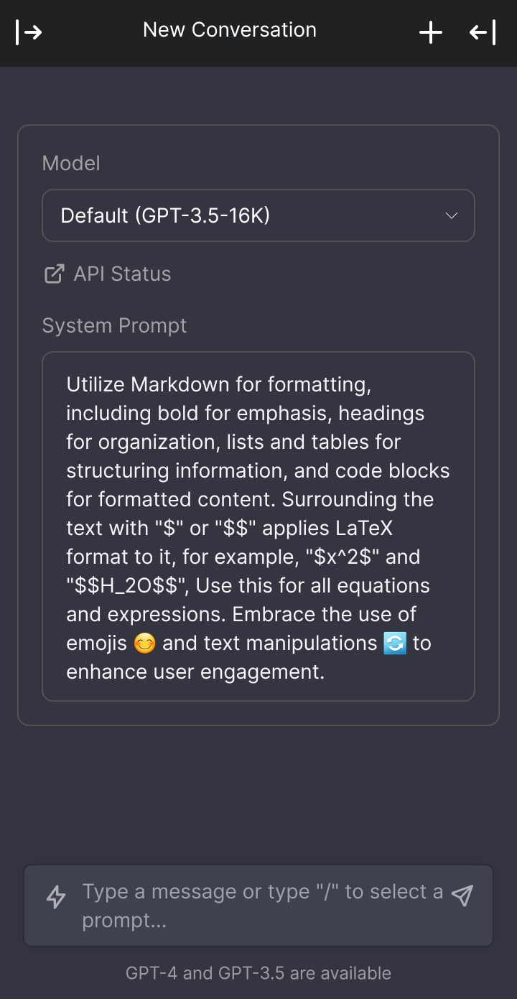

# FGPT Extended

Ultimate Chatbot UI for ChimeraGPT 💬


## Table of Contents

- [Features](#features)
- [Installation](#installation)
- [Usage](#usage)
- [Contribution](#contribution)
- [License](#license)
- [Acknowledgements](#acknowledgements)

## Features ✨

- Updated the list of models to work with the API ✔️
- Check real-time API Status from the UI 📊
- Improved Regenerate Method to prevent errors 🛠️
- Fixed bugs 🐞
- (WIP) Fallback between models automatically 🔄

## Installation

Follow these steps to get a local copy up and running:

1. **Clone the repository**

   To clone the repository, run the following command in your terminal:

   ```bash
   git clone https://github.com/eungangku/fgpt-extended.git
   ```

2. **Navigate to the project directory**

   Change your current working directory to the cloned repository's location:

   ```bash
   cd fgpt-extended
   ```

3. **Install the required dependencies**

   Depending on your project, this step will vary. For example, if your project uses npm, you would use:

   ```bash
   npm install
   ```

4. **Run the project**

   After successfully installing the dependencies, you should now be able to run the project.
   
     ```bash
   npm run dev
   ```

Please ensure you have the correct environment before attempting to install. If you encounter any issues during the installation process, please refer to the 'Issues' tab in the GitHub repository.

## Usage



## Contribution

Contributions are what make the open-source community such an amazing place to learn, inspire, and create. Any contributions you make are **greatly appreciated**. 

Follow these steps to contribute:

1. **Fork** the Project
2. **Create** your Feature Branch (`git checkout -b my-branch-name`)
3. **Commit** your Changes (`git commit -m 'Add some AmazingFeature'`)
4. **Push** to the Branch (`git push origin my-branch-name`)
5. **Open** a Pull Request


We welcome the following types of contributions:

- Bug fixes
- New features
- Documentation improvements
- Code optimizations
- Translations
- Tests

Thank you for your interest in contributing to the FGPT Extended! 🎉

## License

This project is licensed under the terms of the [MIT license](https://github.com/eungangku/fgpt-extended/blob/master/license).

## Acknowledgements

This project contains code from "fgpt" (https://github.com/hihumanzone/fgpt) by hihumanzone


